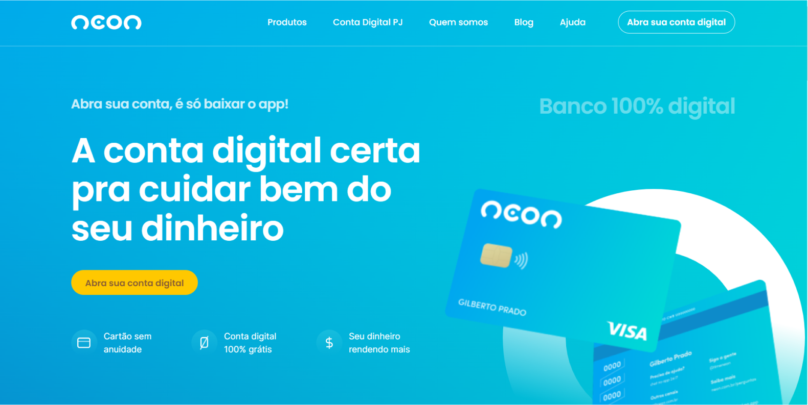

<h1 align="center"> Redesin - Banco NEON </h1>

Landing page do <strong>Banco NEON</strong> desenvolvida durante o curso CodeBoost.
 

  <a href="#-tecnologias">Tecnologias</a>&nbsp;&nbsp;&nbsp;|&nbsp;&nbsp;&nbsp;
  <a href="#-projeto">Projeto</a>&nbsp;&nbsp;&nbsp;|&nbsp;&nbsp;&nbsp;
  <a href="#memo-licença">Licença</a>

  

 

  

## 🚀 Tecnologias

Esse projeto foi desenvolvido com as seguintes tecnologias:

- HTML, SCSS
- JavaScript
- Git e Github
- Figma
- WordPress

## 💻 Projeto

O projeto foi desenvolvido com o objetivo de aperfeiçoar os conhecimentos nas tecnologias utilizadas para a criação de websites, além de aprender a utilizar o WordPress para que o conteúdo da página possa ser gerenciável.

- [Visite o projeto online](https://charlesalmeiida.github.io/neon/)
